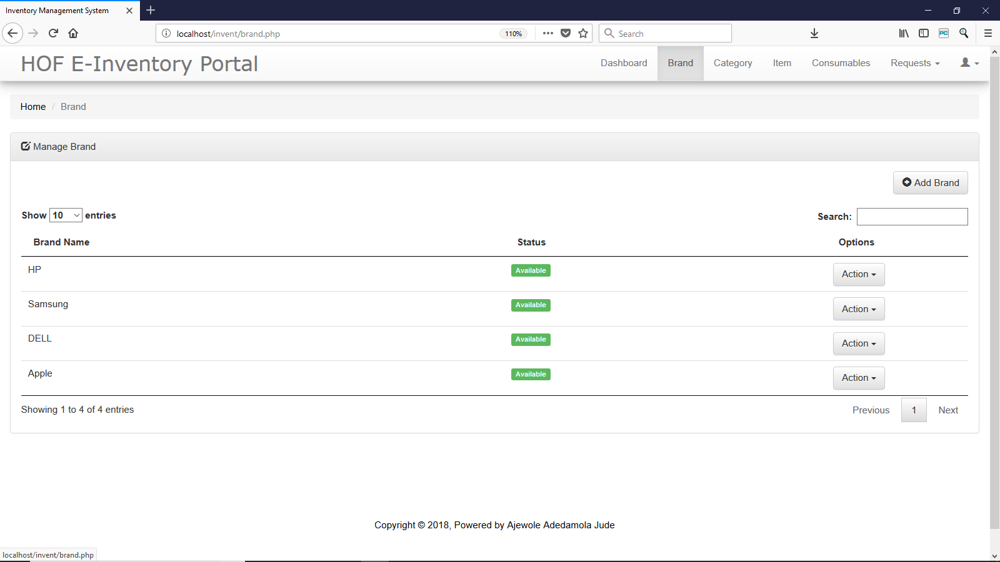

# inventory
This software represents an online inventory system for the department of I.T, in any organization. This software provides inventory associated benefits such as :  To add, update, and remove assets. To add, update, and emove consumables. To add, update, and remove requests for assets To monitor what consumable being used by what asset. To monitor who is with which asset in the organization. To monitor asset flow within the organization. To provide ability to easily query the system. To provide a solution to perfect non-repudiation of asset To print user requests. And a lot of other interesting benefit.
<!DOCTYPE html>
<html>
<head>
<meta name="viewport" content="width=device-width, initial-scale=1">

</head>
<body>

  <a href="#start">Start</a>
  <a href="#about">About</a>
  <a href="#login">Login</a>
  <a href="#dash">Dashboard</a>
  <a href="#brand">Brand</a>
  <a href="#category">Category</a>
  <a href="#asset">Asset / Item</a>
  <a href="#con">Consumable</a>
  <a href="#request">Hardware Request</a>
  <a href="#settings">Settings</a>
  <a href="#admin">Admin Role</a>
  <a href="#guest">Guest</a>
  <a href="#contri">Contribute</a>

  <h2 >Welcome to  E-INVENTORY SYSTEM DOCUMENTATION</h2>
  <h2  id="about">About</h2>
  
This software represents an online inventory system for the department of I.T. This software provides inventory associated benefits such as : 

  <ul>
    <li>
      To add, update, and remove assets.
    </li>
    <li>
      To add, update, and emove consumables.
    </li>
    <li>
      To add, update, and remove requests for assets
    </li>
    <li>
      To monitor what consumable being used by what asset. 
    </li>
    <li>
      To monitor who is with which asset in the organization. 
    </li>
    <li>
      To monitor asset flow within the organization. 
    </li>
    <li>
      To provide ability to easily query the system. 
    </li>
    <li>
      To provide a solution to perfect non-repudiation of asset 
    </li>
    <li>
      To print user requests. 
    </li>

  </ul>
  
And a lot of other interesting benefit.
  
  <h2  id="login" >Login</h2>
  
 To login, provide  your login details

 

<h2  id="dash" >Dashboard</h2>
  
The dashboard is the homepage. It shows the calendar and date, HOF I.T Asset value, total asset, total hardware requests, total consumables in stock and in use.

   

<h2  id="brand" >Brand</h2>
   
In the brand page, you can add, view, edit and remove brand if you are an admin and you can only view if your are a guest.

  
   
  
To add a brand

  
   
  
To edit a brand

  

<h2  id="category" >Category</h2>
   
In the category page, you can add, view, edit and remove category if you are an admin and you can only view if your are a guest.

  
   
  
To add a category

  
   
  
To edit a category

  

  <h2  id="asset" >Asset / Item</h2>
   
In the asset page, you can add, view, edit and remove asset if you are an admin and you can only view if your are a guest.

   
Not available indicates that it is with a user, while Available means it has been returned or never given

  
   
  
To add a asset

  
   
  
To edit a asset

  

   <h2  id="request" >Hardware Request</h2>
   
In the Request page, you can add, view, edit, print, mail and remove hardware request if you are an admin and you can only view if your are a guest.

  
   
  
To add a request

  
   
  
To edit a request

  

To print a user request, make sure you enable pop up on your browser

  

  <h2  id="con" >Consumable</h2>
   
In the consumable page, you can add, view, edit and remove consumablet if you are an admin and you can only view if your are a guest.

  
   
  
To add a consumable

  
   
  
To edit a consumable

  

  <h2  id="settings" >Settings</h2>
   
In the Settings page, you can change your username and password.

  
  

  <h2  id="admin" >Administrator</h2>
   
As an admin, the tab 'action' is visible

  
  
   

  <h2  id="guest" >Guest</h2>
   
As an guest, the tab 'action' is invisible on every page.

  
   
  <h2  id="contri" >Contribute</h2>
   
To contribute mail us on adedamolaajewole@gmail.com

 
  <footer class='footer'>
      

        
Copyright &copy; 2018, Powered by <a href ="https://www.linkedin.com/in/jude-ajewole-40002a140/">Ajewole Adedamola Jude  </a>
   

    </footer>

     
</body>
</html> 
